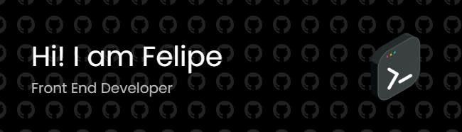

# Hello, I'm Felipe 👋
I am a 23 years old student of BSc in Computer Science (UNLP). 
Also, a JR Front-End Web Developer in continuous growth. 

- 🌱 I’m currently learning **more JS, more HTML and more CSS. In the near future ReactJS.**
-  CEFR: C1 Advanced.

-  

- 

## Projects

- [Personal Web](https://feliperodc.github.io)
- [Le Gout - Restaurante](https://feliperodc.github.io/legout-restaurante/)
- [Arquitech - Estudio Arquitectónico](https://feliperodc.github.io/arquitech-estudio/)

## Languages and Tools (so far):
 

-  

-  

-  

- 

-  

-  

## Knowledge in:

- Responsive Design.

- Single Page Applications (SPAs).

- AJAX (Fetch, Promises)

 

> *Those who keep learning, will keep rising in life.* ~ Charlie Munger

